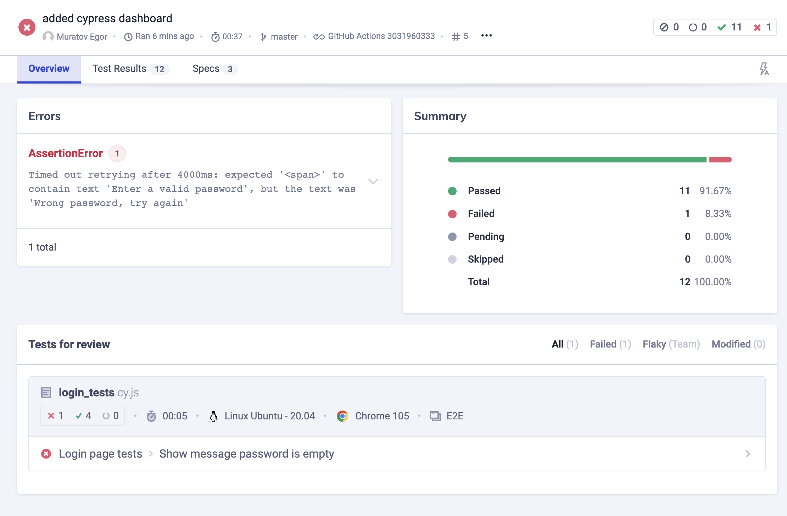
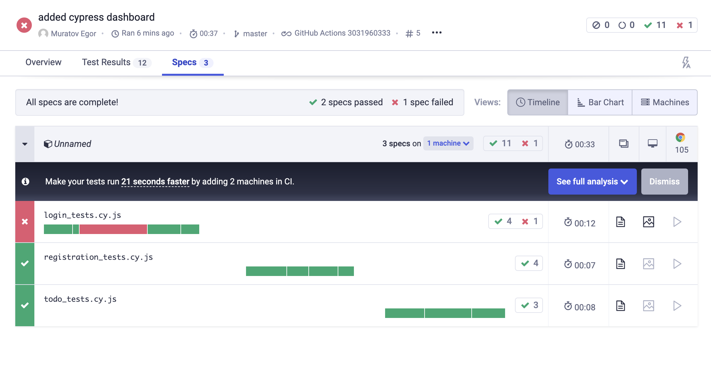
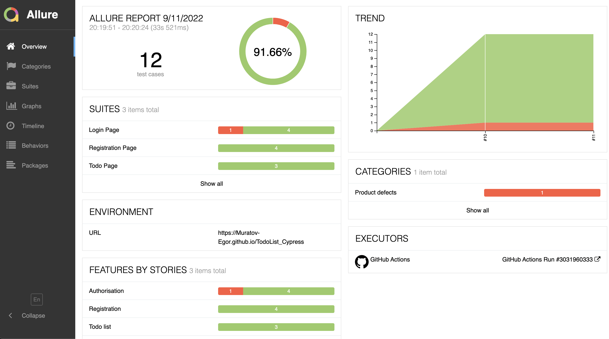
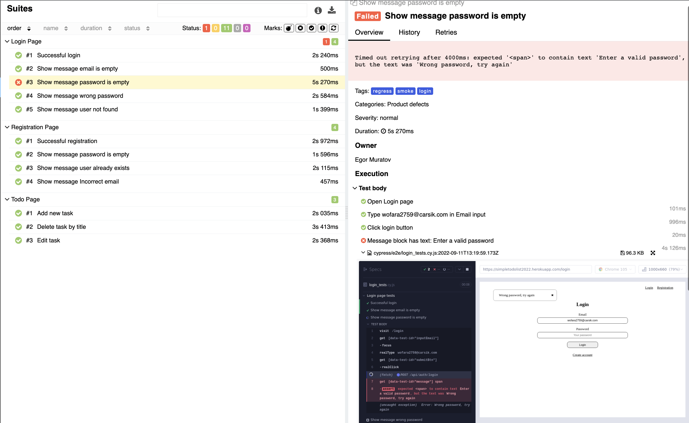
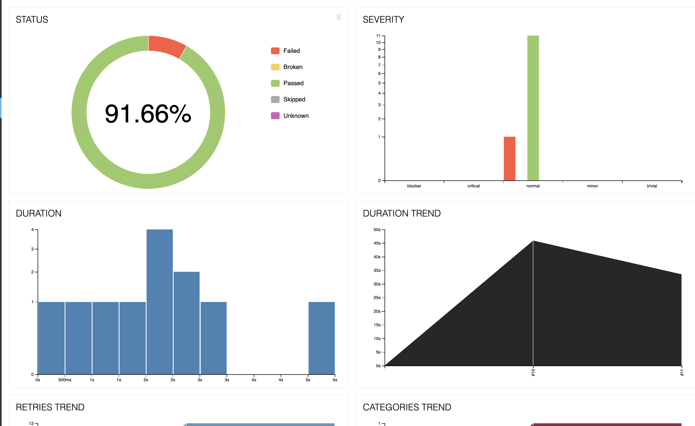
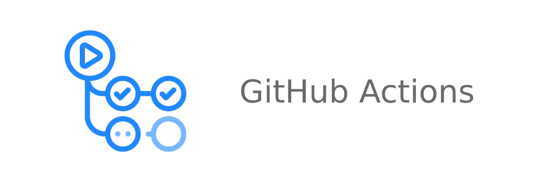
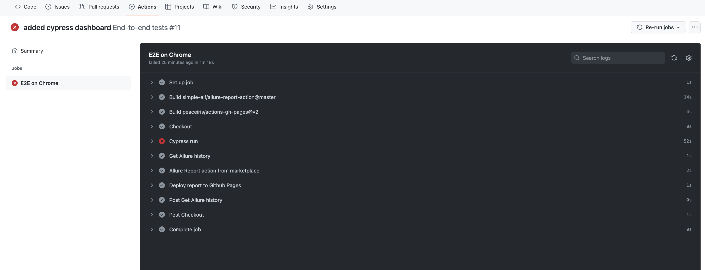
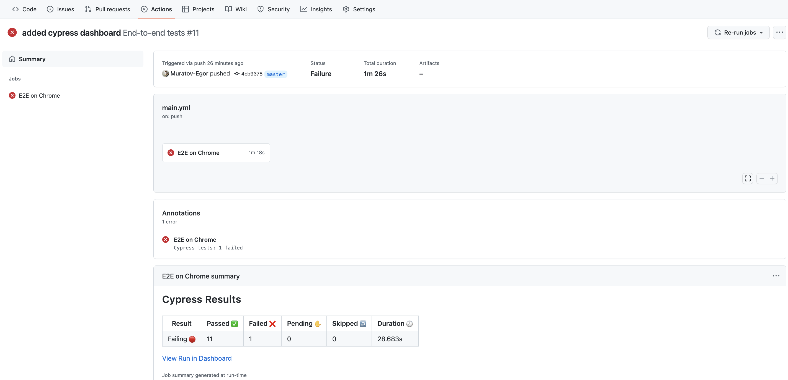
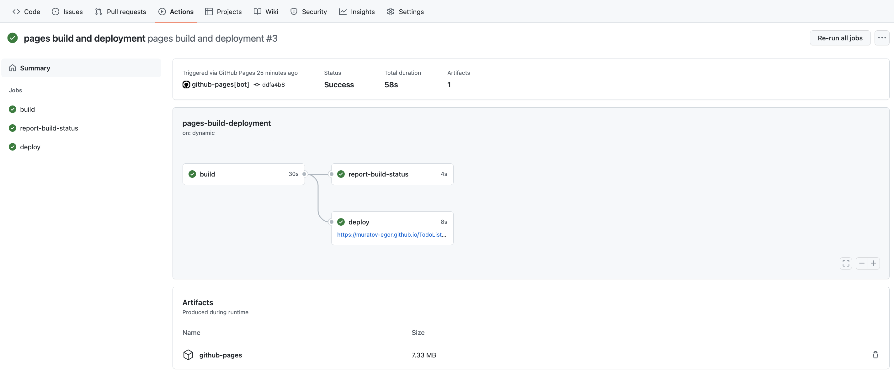

# Cypress ui tests for [My Todo List](https://simpletodolist2022.herokuapp.com/)  ☑
---
## Technologies used:
|                      JavaScript                       |                      Cypress                       |                      GitHub Actions                      |                  Cypress Dashboard                  | Allure Report |
|:-----------------------------------------------------:|:--------------------------------------------------:|:--------------------------------------------------------:|:---------------------------------------------------:|:--------------:|
|  |  |  |  ||
---
##   
## How to use:
### Run all tests locally with UI:
```
yarn cy:open
```
---
###Run all tests locally without UI:

```
yarn cy:run
```
⚠️ *Tests will be run on Google Chrome*

---

### Cypress Dashboard:
[Look at the Cypress Dashboard](https://dashboard.cypress.io/projects/xdm5ap)





---

### 
## How to use:
### Run Allure report:
```
yarn allure:report
```

---

### Clear Allure report:
```
yarn allure:clear
```

### Allure Reports: 
[Look at the Allure Report Page](https://muratov-egor.github.io/TodoList_Cypress)







---
##   





