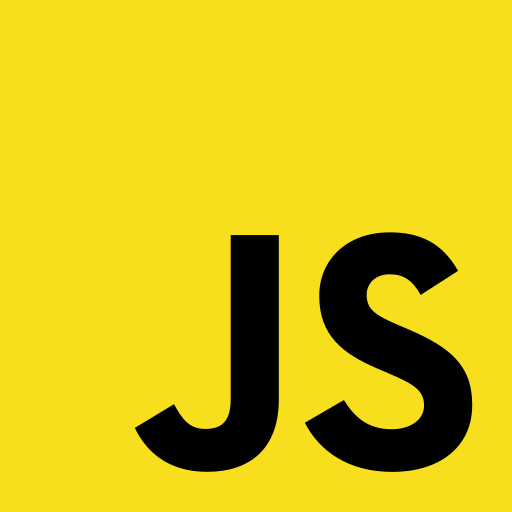
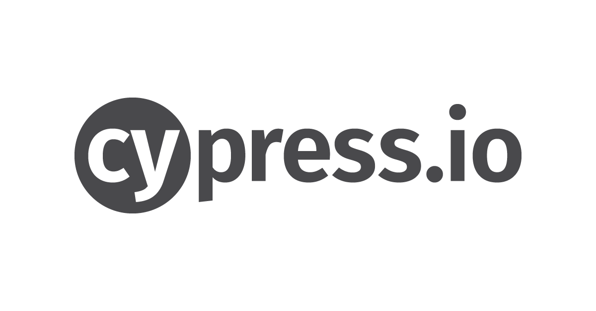

# Cypress ui tests for [My Todo List](https://simpletodolist2022.herokuapp.com/)  ☑
---
## Technologies used:
|                      JavaScript                       |                      Cypress                       |                  Cypress Dashboard                  |                      Allure Report                       |
|:-----------------------------------------------------:|:--------------------------------------------------:|:---------------------------------------------------:|:-------------------------------------------------:|
|  |  |  |  |
---

###  

### Run all tests locally with UI:
```
yarn cy:open
```
---
###Run all tests locally without UI:

```
yarn cy:run
```
⚠️ *Tests will be run on Google Chrome*

---

### 

### Run Allure report:
```
yarn allure:report
```

---

### Clear Allure report:
```
yarn allure:clear
```